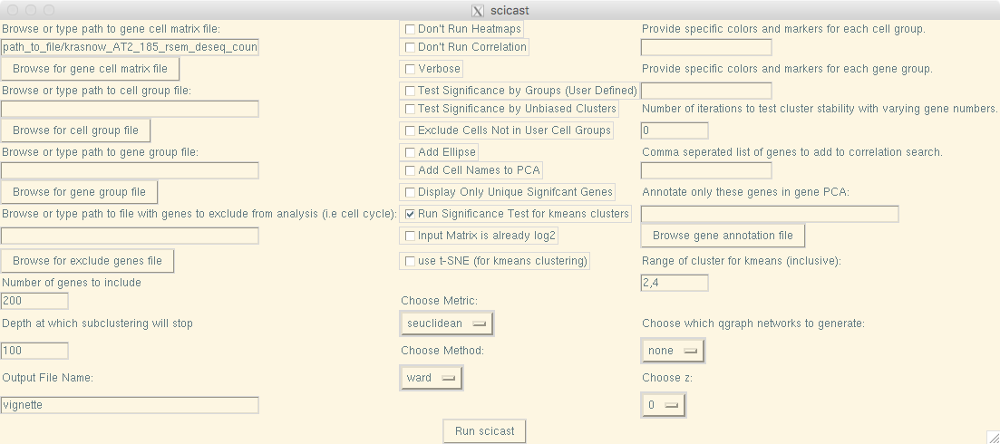
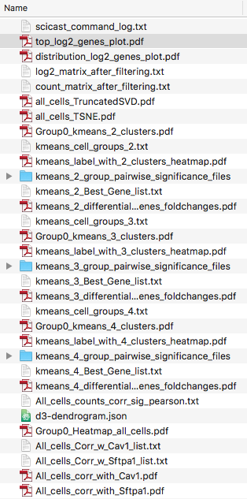
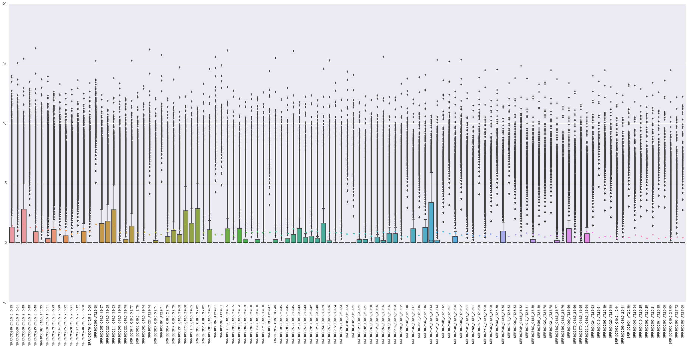
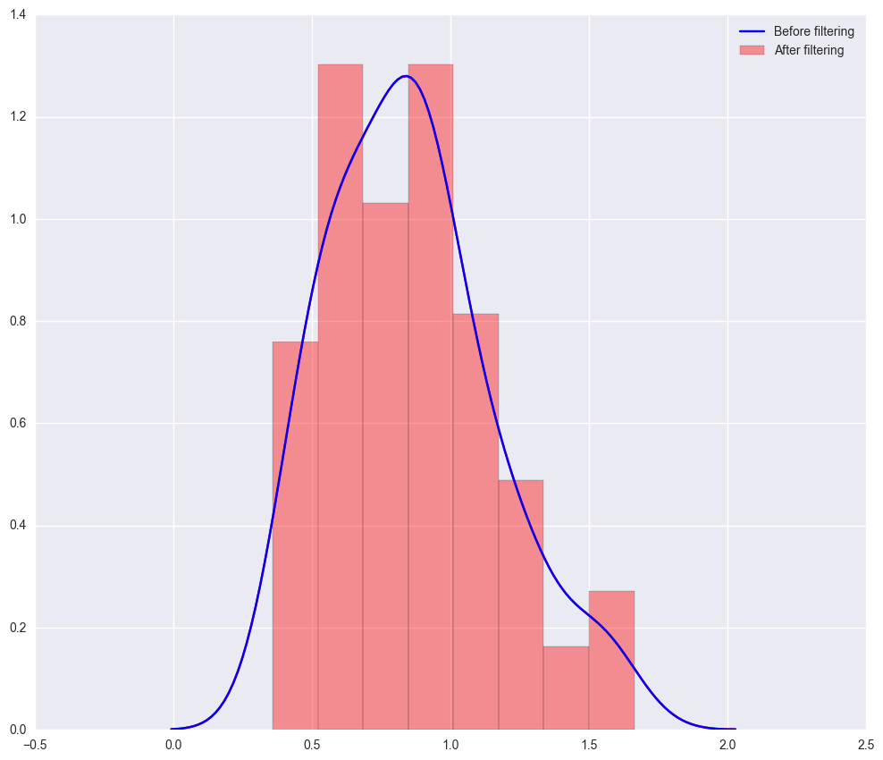
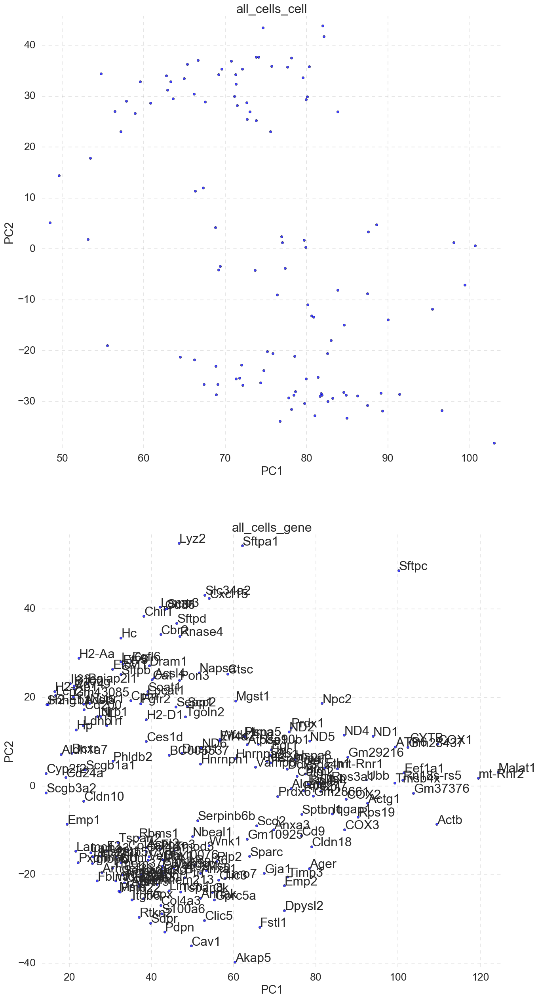
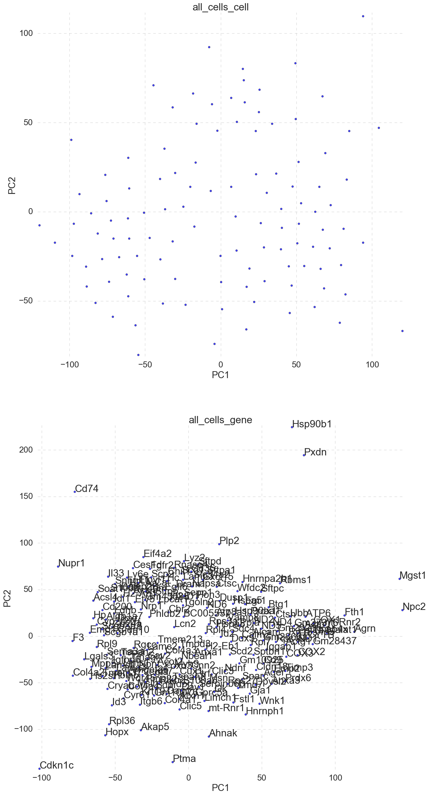
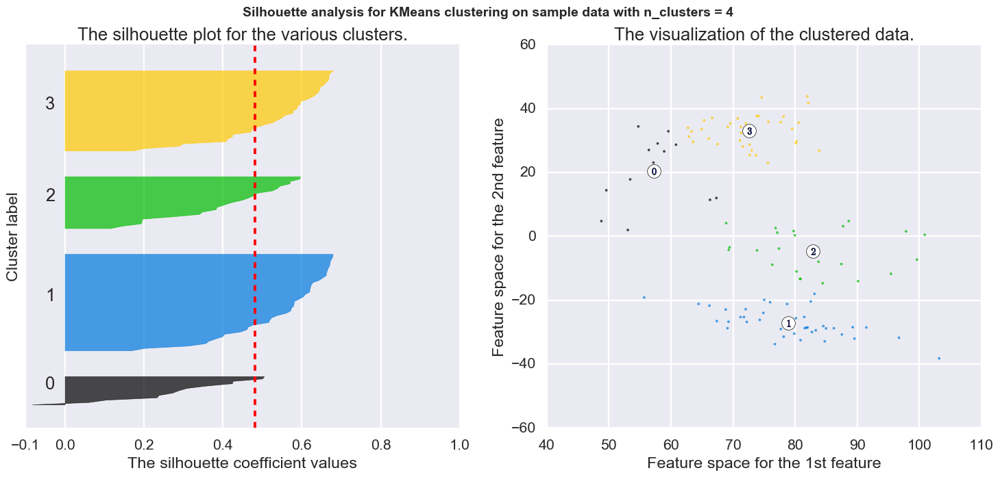
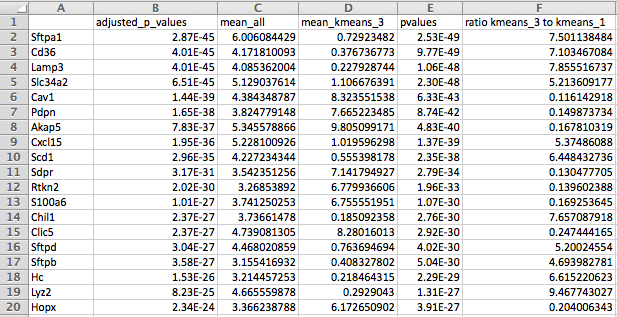
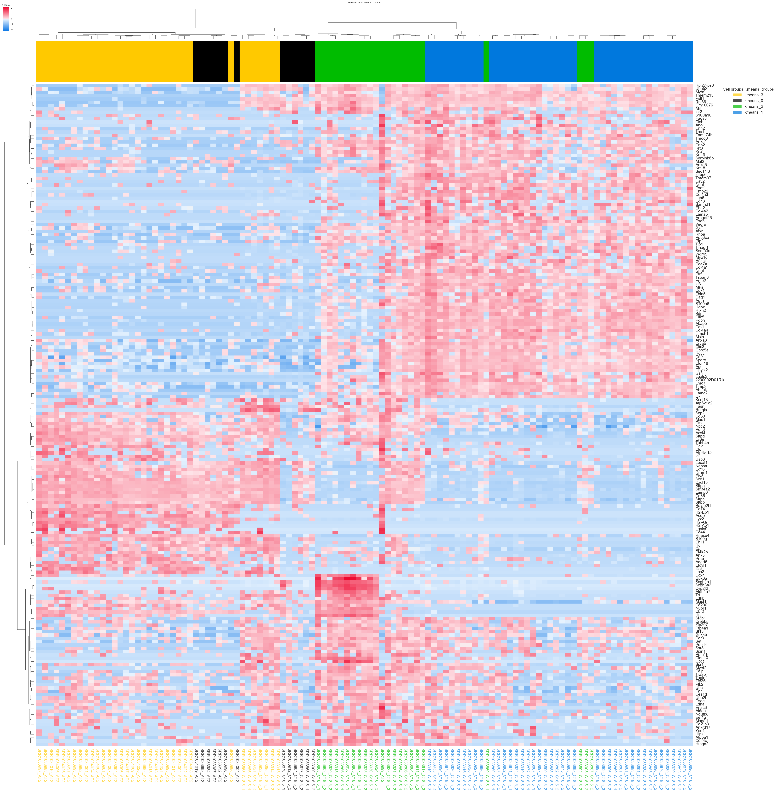
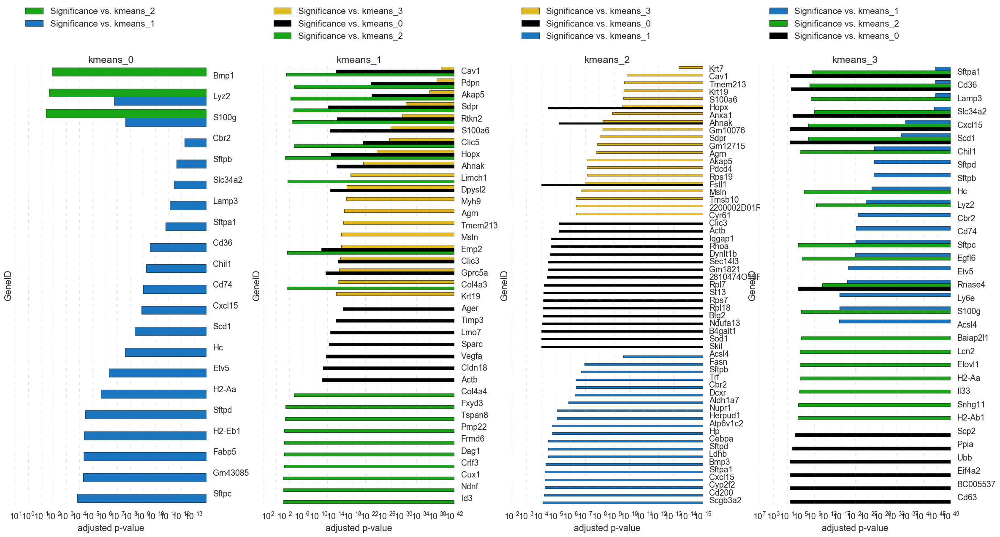

scicast (Single Cell Iterative Clustering and Significance Testing) what does it do?
------------
When approaching large RNA sequencing datasets (single cell or bulk with replicates) the first question is often what are the subsets/groups/populations and what are the defines those groups? This software is designed to do that rapidly and provide the results in multiple visual and data formats that can be used for further analysis.

How do I use it?
------------
After following the installation instructions, it is usable through a gui and through the command line. Both the gui and the command line do the same thing and the command is logged in "scicast_command_log.txt" so that it can be re-run by scicast "copy from log".

**scicast vignette**
==================
Gui and command line for each step will be shown.

Using the provided "krasnow_AT2_185_rsem_deseq_counts_norm.txt" file.



Command Line:

```bash
        scicast -f path_to_file/krasnow_AT2_185_rsem_deseq_counts_norm.txt -n
        vignette -method ward -metric seuclidean -g 200 -depth 100 -z 0
        -qgraph_plot none -kmeans_cluster_range 2,4 -kmeans_sig_test
```

  

**1.  "scicast_command_log.txt" - log of command(s)**  
  Records exact command used to generate the output in the folder. Can be copy pasted to re-run and serves as a record of how results were generated.  
  *Example:*  
  ```bash
          2017-01-07 14:11  
          -f /path_to_file/scicast/krasnow_AT2_185_rsem_deseq_counts_norm.txt
          -n vignette -method ward -metric seuclidean -g 200 -depth 100 -z 0
          -qgraph_plot none -kmeans_cluster_range 2,4 -kmeans_sig_test
          -image_format png
  ```  
**2.  "top_log2_genes_plot.png" - plot of expression in log2 of top genes for each sample.**  
  An overview of expression in all samples and a way to see what samples are included after filtering.  
  *Example:*  
    
**3.  "distribution_log2_genes_plot.png" - distribution of mean expression before and after filtering.**  
  The distribution of mean log2 expression of all genes before and after filtering (often the same, especially if filtered prior to scicast).  
  *Example:*  
    
**4. "log2_matrix_after_filtering.txt" and "count_matrix_after_filtering.txt" - sample-gene matrix files after filtering.**  
  log2 matrix and non-log2 matrix of samples and genes after filter.  
**5. "all_cells_TruncatedSVD.png" -PCA plot PC1 vs PC2 of cells and gene component loading.**  
  scicast uses single variable decomposition (SVD) to plot the PCA of both samples/cells and the gene loadings.  
  *Example:*  
    
**6. "all_cells_TSNE.png" -TSNE diminsional reduction cell and gene loading plots.**  
  scicast will also run TSNE, if the data is variability extends past PC2 (very different cell types, mitosis, death, etc.) TSNE will yeild better results than PCA(SVD).  
  *Example:*  
    
**7. "Group0_kmeans_4_clusters.png" -silhouette plot and kmeans clusters for 4 groups.**  
  If kmeans_cluster_range is not set to 0 scicast will generate kmeans clusters for the specified cluster numbers or range. Default range is 2-4, inclusive. There is an option to use TSNE for kmeans rather than PCA, if TSNE gives better clusters.   
  *Example:*  
    
**8. "kmeans_4_group_pairwise_significance_files" -All of the pairwise significance tests and each group vs all other samples.**  
  If significance testing on kmeans is selected, the output of each significance test will be in a folder for each kmeans group. Can be useful for detailed interrogation of cluster groups. Gene lists can be manually filtered in excel or program of choice. \*Note: Significance testing is time consuming.  
  *Example:*  
    
**9. "Group0_kmeans_4_clusters.png" -Heatmap of all samples color coded by kmeans assignment.**  
  For each kmeans cluster number a heatmap will be generated with the samples color coded by kmeans group. The same colors will be used for cluster, heatmap and the best differential fold change gene plot (if significance testing on kmeans is selected).  
  *Example:*  
    
**10. "kmeans_4_differential_genes_foldchanges.png" -Heatmap of all samples color coded by kmeans assignment.**  
  If significance testing on kmeans is selected, the top genes for each group will be selected by fold change and adjusted pvalue. The output is meant to b used a rough approximation of best markers for each kmeans selected group.  
  *Example:*  
    
